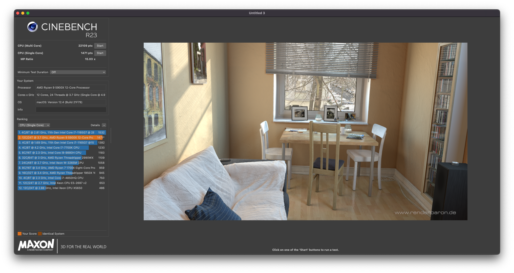

# ASUS ROG Strix B550I + Ryzen 9 5900X + RX 6650 XT

- OpenCore ver 0.8.4
- MacPro7,1
- Ventura 13.0

## Current hardware

Powerful and near-silent even under full CPU load.

- [ROG STRIX B550-I GAMING](https://rog.asus.com/us/motherboards/rog-strix/rog-strix-b550-i-gaming-model/) motherboard.
- AMD [Ryzen 9 5900X](https://www.amd.com/en/products/cpu/amd-ryzen-9-5900x) CPU.
- Phanteks [Glacier One 240MPH](https://phanteks.com/Glacier-One-MP.html) AIO with Noctua NF-A12x25 x2 under the radiator.
- ASUS ROG Strix AMD Radeon [RX 6650 XT](https://www.amd.com/en/products/graphics/amd-radeon-rx-6650-xt) graphics card, PCIe 4.0 riser from case.
- Crucial [Ballistix RGB](https://www.crucial.com/memory/ddr4/bl2k32g32c16u4bl) 64 GB (2 x 32 GB) DDR4 3800MHz CL16 Micron B-die.
- SK Hynix [Platinum P41](https://ssd.skhynix.com/platinum_p41/) 1TB NVMe SSD (Windows + Hackintosh).
- Intel [DC P3600](https://ark.intel.com/content/www/us/en/ark/products/80993/intel-ssd-dc-p3600-series-1-6tb-2-5in-pcie-3-0-20nm-mlc.html) 1.6TB MLC NVMe SSD (Games + Holo)
- Corsair [SF750 Platinum](https://www.corsair.com/us/en/Categories/Products/Power-Supply-Units/Power-Supply-Units-Advanced/SF-Series/p/CP-9020186-NA) SFX PSU.
- Lian Li [A4-H2O](https://lian-li.com/product/a4h2o/) SFF case.

### WiFI / Bt

The built-in components support WiFi 6 / Bluetooth 5 with the AirportItlwm.kext and IntelBluetoothFirmware.kext.

### BIOS

Version 2803

- Fast Boot: `Enabled`
- CSM: `Disabled`
- Above 4G Decoding: `Enabled`
- Resizable Bar Support: `Enabled`
- PCIe slot speed: `Auto`
- Manual XMP Profile activated
- PBO2 PPT: 170 TDC: 140 EDC: 140.

## Usage

1. [Update `PlatformInfo/Generic` stuff](https://dortania.github.io/OpenCore-Post-Install/universal/iservices.html#generate-a-new-serial) with your own, inside `config.plist`
2. Use your Ethernet’s MAC address for `ROM` value, as explained in the Dortania guide. Don’t leave it as all 0s.

### What’s working

Everything.

- CPU Power Management.
- m.2 NVMe and 2.5in NVMe SSD.
- WiFi, Bluetooth, Ethernet.
- All USB ports.
- Radeon GPU is natively supported(after spoofing).
- 4K HDMI or DisplayPort with HDR.
- Watch unlock, Handoff, iMessage, iCloud, Keychain, Xcode etc.
- System Integrity Protection (SIP) fully enabled.
- Sleep / Wake.
- All media & DRM
- Secure Boot + Apple Secure Boot/Vault

### What’s not working

Sidecar most likely. Did not even try it but I suspect it does not work.
OpenRGB also doesn't work.

## Notes

Use at your own risk. 

- All `.efi` drivers and `.kext` are `-RELEASE` builds from the respective packages. 
- OpenCanopy (GUI boot menu) is up and running.
- I boot Windows 11 using rEFInd, thus I can guarantee it will work. I have Win 11 installed on the same SSD.

Good luck.

## Enabling Secure Boot
Check https://www.reddit.com/r/hackintosh/comments/v91q50/secure_booting_with_oc/
